<div align="center">
  <h1>🤖 Gerador Inteligente de PRD</h1>
  
  [](https://opensource.org/licenses/MIT)
  [](https://github.com/alexandre-henrique-rp/Gerador-de-PRP/stargazers)
  [](https://github.com/alexandre-henrique-rp/Gerador-de-PRP/network/members)
  [](http://makeapullrequest.com)
  
  <p><strong>Sistema de IA com 5 agentes especializados para gerar PRDs completos, estruturados e prontos para desenvolvimento</strong></p>
  
  <p>
    <a href="#-como-funciona">Como funciona</a> •
    <a href="#-agentes-especializados">Agentes</a> •
    <a href="#-guia-de-uso">Guia de Uso</a> •
    <a href="#-estrutura">Estrutura</a> •
    <a href="#-exemplo-completo">Exemplo</a>
  </p>
</div>

---

## 🎯 O que é este projeto?

Este é um **sistema de IA multi-agente** que transforma ideias de produto em **Documentos de Requisitos de Produto (PRD) completos e estruturados**, prontos para serem implementados por equipes de desenvolvimento.

### ✨ Diferencial

Em vez de usar um único prompt genérico, este sistema utiliza **5 agentes especializados** que trabalham em sequência, cada um com expertise específica, simulando uma equipe de produto real.

## 🤔 Como Funciona? {#-como-funciona}

O sistema funciona como uma **linha de produção inteligente** com 5 etapas especializadas:

```mermaid
graph LR
    A[💡 Sua Ideia] --> B[📋 Product Owner]
    B --> C[🏗️ Arquiteto de Software]
    C --> D[📊 Scrum Master]
    D --> E[🔍 Revisor Sênior]
    E --> F[⚡ Engenheiro de Prompts]
    F --> G[📄 PRD Completo + Código]
```



### 🎭 Os 5 Agentes Especializados {#-agentes-especializados}

| Agente | 👤 Persona | 🎯 Função | 📊 Saída |
|--------|------------|-----------|----------|
| **01** | **Product Owner** | Analisa requisitos e regras de negócio | `/doc/requisitos/` |
| **02** | **Arquiteto de Software** | Quebra em funcionalidades técnicas | `/doc/funcionalidades/` |
| **03** | **Scrum Master** | Organiza em Epics e Sprints | `/doc/kanban/` |
| **04** | **Revisor Sênior** | Valida consistência do projeto | Aprovação/Correções |
| **05** | **Engenheiro de Prompts** | Gera prompts para código | `/doc/prompts/` |

## 🚀 Guia de Uso {#-guia-de-uso}

### 📋 Pré-requisitos

- ✅ Acesso a IA (ChatGPT, Claude, Gemini, etc.)
- ✅ Sua ideia de produto bem definida
- ✅ ~2 horas para execução completa

### 🎯 Passo a Passo

> **⚠️ Importante:** Execute cada prompt em **sequência** na mesma conversa para manter contexto.

| Etapa | 📁 Arquivo | ⏱️ Tempo | 🎯 Objetivo |
|-------|------------|----------|-------------|
| **1️⃣** | [`01-requisitos.md`](./pronpt/01-requisitos.md) | 15 min | Analisar requisitos de negócio |
| **2️⃣** | [`02-sintetizador.md`](./pronpt/02-sintetizador.md) | 25 min | Quebrar em funcionalidades |
| **3️⃣** | [`03-planejador.md`](./pronpt/03-planejador.md) | 20 min | Organizar em Sprints |
| **4️⃣** | [`04-analize.md`](./pronpt/04-analize.md) | 10 min | Revisar consistência |
| **5️⃣** | [`05-engenheiro.md`](./pronpt/05-engenheiro.md) | 30 min | Gerar prompts de código |

### 💡 Dicas de Execução

```markdown
🎯 **Para melhores resultados:**
• Execute na ordem sequencial (01 → 05)
• Mantenha a mesma conversa/chat
• Seja específico na descrição inicial
• Revise cada etapa antes de prosseguir
• Permita que a IA faça perguntas para clarificar
```

## 🏗️ Estrutura de Saída {#-estrutura}

O sistema gera uma estrutura completa de documentação:

```
projeto/
├── doc/                           # 📁 Documentação gerada
│   ├── requisitos/               # 📋 Análise de negócio
│   │   ├── 01_Visao_Geral_e_Negocio.md
│   │   ├── 02_Usuarios_e_Personas.md
│   │   ├── 03_Stack_Tecnologica_e_Arquitetura.md
│   │   └── 04_Requisitos_Nao_Funcionais.md
│   ├── funcionalidades/          # 🔧 Detalhamento técnico
│   │   ├── funcionalidade_01.md
│   │   ├── funcionalidade_02.md
│   │   └── tecnologias_recomendadas.md
│   ├── kanban/                   # 📊 Gestão de projeto
│   │   └── kanban.md
│   └── prompts/                  # ⚡ Prompts para código
│       ├── T01_prompt.md
│       ├── T02_prompt.md
│       └── ...
└── template/                     # 📄 Templates base
    ├── requisitos/
    ├── funcionalidades/
    └── kanban/
```

### 📊 Templates Incluídos

O projeto vem com **templates profissionais** que guiam a IA:

- **🎯 Requisitos:** Elevator pitch, stakeholders, SMART goals
- **⚙️ Funcionalidades:** User stories, casos de uso, APIs
- **📋 Kanban:** Epics, sprints, definition of done
- **💻 Prompts:** Clean code, SOLID, padrões de IA

## 🎬 Exemplo Completo {#-exemplo-completo}

### 💡 Input: "App de Delivery para Pets"

**Ideia inicial:** 
> "Aplicativo de delivery especializado em produtos para pets, com ração, brinquedos e consultas veterinárias online"

### 📊 Output Gerado:

<details>
<summary><strong>📋 Ver estrutura completa gerada</strong></summary>

**1. Requisitos de Negócio:**
- Análise de mercado pet brasileiro (R$ 54 bi)
- 3 personas detalhadas (Pet owner urbano, Veterinário, etc.)
- Stack sugerida (React Native, Node.js, MongoDB)
- Requisitos não-funcionais (99.9% uptime, LGPD)

**2. Funcionalidades Técnicas:**
- Sistema de autenticação
- Catálogo de produtos
- Carrinho e checkout  
- Agendamento veterinário
- Sistema de entrega
- Avaliações e reviews

**3. Gestão de Projeto:**
- 8 Epics organizados
- 45 tarefas distribuídas em 6 sprints
- Estimativas em story points
- Critérios de aceite definidos

**4. Prompts de Código:**
- 45 prompts especializados
- Padrões Clean Code + SOLID
- Técnicas CoT, ReAct, APE
- Exemplos de input/output
</details>

**Resultado:** PRD completo de ~50 páginas, pronto para desenvolvimento!

## 🆚 Comparação com Métodos Tradicionais

| Aspecto | Método Tradicional | **Gerador Inteligente** |
|---------|-------------------|------------------------|
| **Tempo** | 2-4 semanas | 2 horas |
| **Consistência** | Varia por pessoa | Sempre estruturado |
| **Completude** | Muitas vezes incompleto | 100% das seções |
| **Técnico** | Foco em negócio | Negócio + Técnico + Código |
| **Reusabilidade** | Baixa | Templates reutilizáveis |

## 🛠️ Tecnologias e Padrões

### 🎯 Padrões de IA Utilizados

- **Chain-of-Thought (CoT):** Raciocínio passo a passo
- **ReAct:** Pensamento → Ação → Observação  
- **APE:** Auto-refinamento de prompts
- **Self-Consistency:** Múltiplas variações

### 🏗️ Arquitetura Recomendada

- **Clean Code:** Código limpo e legível
- **SOLID:** Princípios de design
- **DDD:** Domain-Driven Design
- **Microserviços:** Escalabilidade

## 🤝 Contribuição {#-contribuição}

### 🎯 Como Contribuir

1. **Fork** o projeto
2. **Clone** localmente
3. **Melhore** templates ou prompts
4. **Teste** com projetos reais
5. **Submeta** Pull Request

### 💡 Ideias de Melhorias

- [ ] Templates para outros domínios (fintech, saúde, educação)
- [ ] Integração com ferramentas (Jira, Notion, Figma)
- [ ] Versões em outros idiomas
- [ ] Templates para diferentes metodologias (Shape Up, Design Sprint)

## 📄 Licença

Distribuído sob a licença MIT. Veja [`LICENSE`](LICENSE) para mais informações.

## 🏆 Créditos

Inspirado nas melhores práticas de:
- Prompt Engineering (OpenAI, Anthropic, Google)

---

<div align="center">
  <p><strong>🚀 Pronto para gerar seu PRD inteligente?</strong></p>
  
  <p>
    <a href="./pronpt/01-requisitos.md">🎯 Começar com Prompt 1</a> •
    <a href="https://github.com/alexandre-henrique-rp/Gerador-de-PRP/issues">🐛 Reportar Issue</a> •
    <a href="https://github.com/alexandre-henrique-rp/Gerador-de-PRP/discussions">💬 Discussões</a>
  </p>
  
  <p>
    Feito com ❤️ por <a href="https://github.com/alexandre-henrique-rp">Alexandre Henrique</a>
  </p>
  
  <p><em>⭐ Se este projeto te ajudou, considere dar uma estrela!</em></p>
</div>